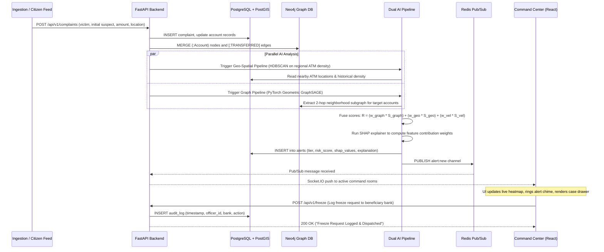

# RakshaNet 🛡️
### Predictive Cash-Out Hotspot Intelligence & Multi-Hop Mule Interdiction Platform

RakshaNet is an enterprise-grade cyber-financial fraud interdiction platform designed to halt fund dissipation during the critical **"Golden Window"** (the first 180–240 minutes following an attack). By unifying spatial-temporal clustering with inductive graph neural networks (GNNs), RakshaNet shifts fraud response from reactive forensic accounting to proactive topological interdiction.

---

## 1. Executive Summary & Problem Context

In modern cyber-financial fraud, stolen capital does not stay in a single victim-facing account. Instead, criminal syndicates execute a high-speed, layered evasion strategy:
1. **Layer 0 (Victim Debit):** Unauthorized withdrawal or social engineering transfer occurs.
2. **Layers 1–4 (Rapid Mule Layering):** Funds are partitioned and laundered through multiple hops across synthetic and compromised mule accounts within **45 minutes**.
3. **Layer 5 (Cash-Out Liquidation):** Mules execute coordinated ATM withdrawals across physical geographic hotspots within **180–240 minutes**, permanently destroying fund traceability.

```
[Victim Debit] ──(15 min)──> [Hop 1: Mule] ──(30 min)──> [Hop 2-3: Mule Ring] ──(180-240 min)──> [ATM Cash-Out Hotspots]
                                                                                                           │
Traditional Post-Complaint Response: 24 to 72 hours  ───> Funds permanently liquidated ❌                 │
RakshaNet Dual-AI Predictive Interdiction: < 60 sec  ───> Pre-emptive Lien & Field Dispatch 🎯 ───────────┘
```

### The Core Value Proposition (UVP): Prediction vs. Detection
* **Standard Fraud Detection Systems:** Evaluate historical behavioral anomalies on accounts that have *already* transacted. By the time an account exhibits anomalous behavior, the funds have often moved.
* **RakshaNet Topological Prediction:** Evaluates the **structural position** of unflagged, zero-history accounts within the multi-hop transaction graph using inductive link prediction (GraphSAGE). A brand-new account with zero prior fraud complaints is identified as a high-risk mule target simply because of its topological bridge position between known fraud clusters. Simultaneously, geospatial algorithms forecast which specific ATMs/zones will experience withdrawal pressure.

---

## 2. System Architecture & High-Level Flow

RakshaNet employs a modular, decoupled architecture where each specialized engine and data store executes the workload it is natively optimized for:

```
┌────────────────────────────────────────────────────────────────────────────────────────┐
│                                 DATA INGESTION LAYER                                   │
│            • Citizen Complaint Ingestion Feed   • Core Banking Webhooks                │
└───────────────────────────────────────────┬────────────────────────────────────────────┘
                                            ▼
┌────────────────────────────────────────────────────────────────────────────────────────┐
│                              POLYGLOT STORAGE LAYER                                    │
│  ┌─────────────────────────────┐ ┌──────────────────────────┐ ┌──────────────────────┐ │
│  │   PostgreSQL 16 + PostGIS   │ │    Neo4j 5 Community     │ │   Redis 7 (Alpine)   │ │
│  │   Relational & Geospatial   │ │   Property Graph for     │ │   Hot State Cache    │ │
│  │   System of Record          │ │   Multi-Hop Mule Chains  │ │   & Pub/Sub Broker   │ │
│  └─────────────────────────────┘ └──────────────────────────┘ └──────────────────────┘ │
└───────────────────────────────────────────┬────────────────────────────────────────────┘
                                            ▼
┌────────────────────────────────────────────────────────────────────────────────────────┐
│                             DUAL AI INTERDICTION PIPELINE                              │
│  ┌──────────────────────────────────────┐     ┌──────────────────────────────────────┐ │
│  │   Branch A: Graph Link Predictor     │     │  Branch B: Geo-Temporal Forecaster   │ │
│  │   (GraphSAGE / PyTorch Geometric)    │     │  (HDBSCAN + XGBoost + Prophet)       │ │
│  │   • Inductive Node Embeddings        │     │  • Spatial Density Hotspots          │ │
│  │   • Adamic-Adar / Jaccard Proximity  │     │  • ATM Liquidation Probability       │ │
│  └──────────────────┬───────────────────┘     └──────────────────┬───────────────────┘ │
│                     └─────────────────────┬──────────────────────┘                     │
│                                           ▼                                            │
│  ┌──────────────────────────────────────────────────────────────────────────────────┐  │
│  │  Intelligent Risk Fusion Engine:  R = w1·S_graph + w2·S_geo + w3·S_velocity      │  │
│  │  Explainable AI (SHAP Engine):    Local feature attribution & legal audit logs   │  │
│  └────────────────────────────────────────┬─────────────────────────────────────────┘  │
└───────────────────────────────────────────┬────────────────────────────────────────────┘
                                            ▼
┌────────────────────────────────────────────────────────────────────────────────────────┐
│                        REAL-TIME DISPATCH & OPERATIONAL UI                             │
│   • Socket.IO Event Broadcaster (Redis Pub/Sub adapter)                                │
│   • Inter-Bank Webhook Dispatcher (Automated Lien / Freeze Requests)                   │
│   • Tactical Command Center (React 18, Leaflet GeoJSON, Interactive Subgraphs)         │
└────────────────────────────────────────────────────────────────────────────────────────┘
```

---

## 3. End-to-End Data Lifecycle (One Concrete Trace)



---

## 4. Polyglot Storage Architecture

RakshaNet avoids stretching a single database across mismatched workloads. Each database handles its native domain:

### A. PostgreSQL 16 + PostGIS 3.4 (Relational & Spatial System of Record)
* **`complaints`**: Primary crime record (`id`, `complaint_number`, `victim_account`, `initial_suspect_account`, `amount_lost`, `category`, `reported_at`, `location` as `GEOMETRY(Point, 4326)`).
* **`accounts`**: Master entity for bank accounts (`id`, `account_number`, `bank_name`, `ifsc`, `opened_at`, `current_balance`, `mule_score`, `geo_risk_score`, `final_risk_score`, `risk_tier`, `is_frozen`).
* **`transactions`**: High-frequency financial ledger (`id`, `from_account_id`, `to_account_id`, `amount`, `timestamp`, `channel`, `is_flagged`).
* **`atm_locations`**: Physical ATM infrastructure catalog (`id`, `atm_id`, `bank_name`, `address`, `location` as `GEOMETRY(Point, 4326)`, `historical_withdrawal_density`, `cash_exhaustion_risk`).
* **`alerts`**: High-priority tactical warnings (`id`, `target_account_id`, `predicted_atm_id`, `risk_tier`, `risk_score`, `shap_values` [JSONB], `explanation` [TEXT], `status`: `active | acknowledged | freeze_requested | freeze_confirmed`).
* **`audit_log`**: Immutable chain of custody (`id`, `timestamp`, `actioned_by`, `action`, `target_entity`, `status_details`, `ip_address`).

### B. Neo4j 5 Community (Property Graph Database)
Maintains pure topological structure for multi-hop graph traversals. Relational metadata is left in PostgreSQL.
* **Nodes**:
  * `(:Account {id: STRING, account_number: STRING, bank: STRING, ifsc: STRING, is_fraud_labeled: BOOLEAN})`
  * `(:ATMLocation {id: STRING, atm_id: STRING, lat: FLOAT, lng: FLOAT})`
* **Relationships**:
  * `(:Account)-[:TRANSFERRED {txn_id: STRING, amount: FLOAT, timestamp: DATETIME, is_suspicious: BOOLEAN}]->(:Account)`
  * `(:Account)-[:WITHDREW_AT {txn_id: STRING, amount: FLOAT, timestamp: DATETIME}]->(:ATMLocation)`
* **Core 2-Hop Cypher Traversal:**
  ```cypher
  MATCH path = (target:Account {id: $account_id})-[:TRANSFERRED*1..2]-(neighbor:Account)
  RETURN path
  ```

### C. Redis 7 (In-Memory Hot State & Pub/Sub)
* Fast session validation and token blocklisting.
* Spatial indexing of active law enforcement patrols (`GEOADD`, `GEORADIUS`).
* Pub/Sub message broker connecting background AI evaluation workers to the WebSocket gateway.

---

## 5. Dual AI Interdiction Pipeline

### Branch A: GraphSAGE Inductive Link Prediction (`backend/app/ai/graph_predictor.py`)
Standard Matrix Factorization and transductive algorithms fail when new accounts appear in real time. RakshaNet utilizes **GraphSAGE (PyTorch Geometric)** to generate inductive node embeddings by aggregating feature representations from an account’s local network neighborhood:
$$\mathbf{h}_v^{(k)} = \sigma \left( \mathbf{W}^{(k)} \cdot \text{CONCAT}\left(\mathbf{h}_v^{(k-1)}, \text{AGGREGATE}_k \left( \left\{ \mathbf{h}_u^{(k-1)}, \forall u \in \mathcal{N}(v) \right\} \right)\right) \right)$$
* **Feature Set**: Indegree, outdegree, transaction velocity, Adamic-Adar proximity to verified fraud rings, Jaccard network overlap, PageRank centrality, and shortest hop distance to known mules.
* **UVP Invariance**: A newly registered account with zero past transactions scores critically high if it is situated topologically between two active fraud subgraphs.

### Branch B: Geo-Temporal Hotspot Forecaster (`backend/app/ai/geo_hotspot.py`)
Predicts physical cash-out locations by combining spatial density with temporal withdrawal velocity:
1. **Spatial Clustering (HDBSCAN):** Groups recent victim debit points and historical ATM liquidation sites into spatial clusters, accounting for noise and varying density.
2. **ATM Risk Classifier (XGBoost):** Classifies individual ATMs within active clusters based on distance to highway exits, unmonitored booth density, historical night cash-outs, and rapid-succession withdrawals.
3. **Temporal Demand Regressor (Prophet):** Models time-series liquidation curves to predict the exact 30-minute window of peak ATM withdrawal pressure.

### Risk Fusion & Threshold Calibration (`backend/app/ai/risk_fusion.py`)
Combines multi-modal outputs into a unified score $R \in [0, 100]$:
$$R = 100 \cdot \left( w_{\text{graph}} \cdot S_{\text{graph}} + w_{\text{geo}} \cdot S_{\text{geo}} + w_{\text{velocity}} \cdot S_{\text{velocity}} \right)$$
* **Low Tier (0–39):** Passive observation, standard monitoring.
* **Medium Tier (40–69):** Heightened alert, automated anomaly flag sent to branch risk officer.
* **Critical Tier (70–100):** Real-time command center alert chime, automatic lien request dispatch, dynamic heatmap red-zone generation.

### Explainable AI Engine (`backend/app/ai/shap_explainer.py`)
Black-box ML predictions cannot stand as evidence for account freezing. RakshaNet runs **TreeSHAP / KernelSHAP** to compute feature attributions $\phi_i$ for every flagged entity:
$$\sum_{i=1}^{M} \phi_i(x) = f(x) - \mathbb{E}[f(z)]$$
Generates structured legal justification text:
> *"Account XXXX9812 scored 91 (Critical). 2 hops from 3 confirmed fraud syndicates (+0.34 SHAP), ATM Cluster #4 historical cash-out correlation (+0.26 SHAP), account opened < 48 hours ago (+0.21 SHAP), multi-regional IFSC dispersal (+0.19 SHAP)."*

---

## 6. Inter-Agency Workflow & Legal Honesty Standard

In strict compliance with banking operations and legal standards:
* **The System Does Not Unilaterally Freeze Bank Accounts.** Automated arbitrary freezing without institutional authorization violates banking protocols.
* **Correct Terminology:**
  * Action Button: `"Log Freeze Request"`
  * Processing State: `"Dispatching to [Bank Name] API via CFCFRMS"`
  * Final State: `"Freeze Request Logged — Awaiting Bank Lien Confirmation"`
* Every action creates an immutable, SHA-256 verified entry in `audit_log` with operator identity, IP address, timestamp, and the exact SHAP explanation payload.

---

## 7. REST API & WebSocket Specifications

### REST Endpoints (FastAPI)

| Method | Endpoint | Description |
|---|---|---|
| `POST` | `/api/v1/complaints` | Ingest new citizen or portal complaints |
| `GET` | `/api/v1/complaints` | Paginated complaint query with status filter |
| `GET` | `/api/v1/accounts/{id}/risk` | Real-time topological and spatial risk assessment |
| `GET` | `/api/v1/alerts` | Paginated tactical alert feed (tier, status, date) |
| `GET` | `/api/v1/alerts/{id}/explain` | Return SHAP feature weights and plain-language reasoning |
| `POST` | `/api/v1/freeze` | Issue formal lien/freeze request to beneficiary bank |
| `GET` | `/api/v1/heatmap` | GeoJSON FeatureCollection of predicted cash-out hotspots |
| `GET` | `/api/v1/stats` | Platform KPIs: funds at risk, prevented loss, recovery rate |
| `POST` | `/api/v1/auth/token` | OAuth2 JWT token acquisition (Admin, Analyst, Officer) |

#### Sample Contract: `GET /api/v1/alerts/{id}/explain`
```json
{
  "alert_id": "7c9e6679-7425-40de-944b-e07fc1f90ae7",
  "tier": "critical",
  "risk_score": 91.4,
  "confidence": 0.94,
  "explanation": "Account scored 91 (Critical). 2 hops from 3 known fraud rings (+0.32), ATM cluster #7 shows elevated historical fraud density (+0.24), account opened 48h ago (+0.18), unusual IFSC pattern (+0.17).",
  "shap_values": {
    "fraud_hop_count": 0.32,
    "atm_cluster_density": 0.24,
    "account_age_hours": 0.18,
    "ifsc_diversity": 0.17,
    "txn_velocity": 0.09
  },
  "graph_context": {
    "hops_to_nearest_fraud": 2,
    "fraud_neighbors_count": 3
  }
}
```

### WebSocket Real-Time Events (`ws://host:8000/socket.io`)
* **`alert:new`**: Emitted when fusion engine calculates risk score $\ge 70$.
* **`heatmap:update`**: Emitted when cluster centroids recompute following new complaint ingestion.
* **`case:status_change`**: Broadcasts lien acknowledgement updates from banking partners.

---

## 8. Complete Project File Structure & Contributor Guide

The repository is structured so individual contributors can take ownership of discrete modules without cross-file merge conflicts:

```
RakshaNet/
├── .gitignore                          # Standard git exclusions (.env, __pycache__, node_modules)
├── backend/
│   ├── Dockerfile                      # Python 3.11 Debian Slim container configuration
│   ├── requirements.txt                # FastAPI, PyG, PostGIS, Neo4j, Redis dependencies
│   ├── alembic.ini                     # Database migration configuration
│   ├── alembic/
│   │   └── versions/.gitkeep           # Database migration revisions
│   ├── generators/                     # Synthetic Data Engine
│   │   ├── __init__.py
│   │   ├── generate_all.py             # Orchestrator to generate & seed Postgres and Neo4j
│   │   ├── complaint_gen.py            # Generates realistic citizen reports with Indian locales
│   │   ├── transaction_gen.py          # Generates high-volume multi-layer transaction histories
│   │   ├── account_gen.py              # Generates KYC accounts, IFSCs, and banks
│   │   ├── atm_gen.py                  # Generates geolocated ATM records across metro clusters
│   │   └── graph_gen.py                # Injects star, chain, and fan-out mule topologies
│   └── app/
│       ├── __init__.py
│       ├── main.py                     # FastAPI application factory, middleware, CORS, lifecycle
│       ├── config.py                   # Pydantic BaseSettings loading environment variables
│       ├── models/                     # SQLAlchemy 2.0 ORM Definitions
│       │   ├── __init__.py
│       │   ├── complaint.py            # Complaint ORM model with GeoAlchemy2 Point
│       │   ├── account.py              # Account ORM model with risk score attributes
│       │   ├── transaction.py          # Transaction ORM model with temporal indexes
│       │   ├── atm_location.py         # ATM Location ORM model with PostGIS coordinates
│       │   ├── alert.py                # Alert ORM model with JSONB SHAP storage
│       │   └── audit_log.py            # Audit log ORM model with SHA-256 verification
│       ├── schemas/                    # Pydantic Schemas (Validation & Serialization)
│       │   ├── __init__.py
│       │   ├── complaint.py            # ComplaintCreate, ComplaintRead
│       │   ├── account.py              # AccountRead, AccountRiskUpdate
│       │   ├── alert.py                # AlertRead, AlertExplainResponse
│       │   ├── heatmap.py              # GeoJSON Feature and FeatureCollection models
│       │   └── stats.py                # Dashboard platform KPI summaries
│       ├── api/                        # FastAPI Route Handlers
│       │   ├── __init__.py
│       │   ├── router.py               # Master APIRouter mounting all sub-endpoints
│       │   ├── complaints.py           # Ingestion & listing endpoints
│       │   ├── accounts.py             # Account query & topological risk endpoints
│       │   ├── alerts.py               # Alert feed, case drawer, & SHAP explain endpoint
│       │   ├── heatmap.py              # Dynamic GeoJSON cluster coordinates endpoint
│       │   ├── freeze.py               # Bank lien / freeze dispatch endpoints
│       │   ├── stats.py                # System-wide interdiction metric endpoints
│       │   └── auth.py                 # JWT login, refresh, & RBAC dependency injection
│       ├── services/                   # Core Business Logic Layer
│       │   ├── __init__.py
│       │   ├── ingestion.py            # Parses incoming complaints & coordinates DB writes
│       │   ├── graph_service.py        # Neo4j Cypher queries & subgraph extraction
│       │   ├── geo_service.py          # PostGIS spatial radius & boundary query service
│       │   ├── alert_service.py        # Evaluates thresholds & creates alert records
│       │   └── explain_service.py      # Formats SHAP vectors into human-readable text
│       ├── ai/                         # Machine Learning Pipeline
│       │   ├── __init__.py
│       │   ├── geo_hotspot.py          # HDBSCAN spatial clustering + XGBoost ATM scorer
│       │   ├── graph_predictor.py      # PyTorch Geometric 2-Layer GraphSAGE link predictor
│       │   ├── risk_fusion.py          # Calibrated multi-modal risk score fusion
│       │   ├── shap_explainer.py       # SHAP TreeExplainer & feature attribution vectors
│       │   └── models/.gitkeep         # Storage for trained model weights (.pt, .joblib)
│       ├── realtime/                   # WebSocket & Pub/Sub Gateway
│       │   ├── __init__.py
│       │   ├── socket_server.py        # Socket.IO ASGI application mounted on FastAPI
│       │   ├── events.py               # Event name definitions & room routing logic
│       │   └── dispatcher.py           # Redis pub/sub listener pushing to WebSocket clients
│       └── db/                         # Data Drivers & Connections
│           ├── __init__.py
│           ├── postgres.py             # Async SQLAlchemy engine & get_db session dependency
│           ├── neo4j_driver.py         # Async Bolt Neo4j driver connection pool
│           └── redis_client.py         # Redis connection pool & pub/sub helpers
│
├── frontend/
│   ├── Dockerfile                      # Multi-stage build (Node build -> NGINX serve)
│   ├── package.json                    # React 18, Vite, Leaflet, Recharts, Socket.io-client
│   ├── vite.config.js                  # Vite bundler configuration & dev server proxy
│   ├── index.html                      # HTML entrypoint with viewport & font imports
│   └── src/
│       ├── main.jsx                    # React DOM root render
│       ├── App.jsx                     # Application routing & context providers
│       ├── index.css                   # Global styling, modern dark theme design system
│       ├── contexts/                   # State Management Contexts
│       │   ├── AuthContext.jsx         # User authentication, token lifecycle & user roles
│       │   └── AlertContext.jsx        # Real-time alert store synced with WebSockets
│       ├── hooks/                      # Custom React Hooks
│       │   ├── useSocket.js            # Manages WebSocket connection & event listeners
│       │   ├── useAlerts.js            # Fetches, filters, and paginates alert data
│       │   └── useApi.js               # Axios wrapper with automatic Bearer token injection
│       ├── pages/                      # Top-Level Page Views
│       │   ├── LoginPage.jsx           # Secure authentication portal
│       │   ├── DashboardPage.jsx       # Tactical Command Center (Map, Feed, Case Drawer)
│       │   ├── CommandPage.jsx         # Executive macro view & jurisdictional analytics
│       │   └── NotFoundPage.jsx        # 404 Route handler
│       ├── components/                 # Reusable UI Components
│       │   ├── layout/
│       │   │   ├── Sidebar.jsx         # Navigation bar with route switches
│       │   │   ├── TopBar.jsx          # Live clock, system status, active officer badge
│       │   │   └── RoleBadge.jsx       # Visual tag displaying user security clearance
│       │   ├── map/
│       │   │   ├── HeatmapView.jsx     # Leaflet canvas rendering hotspot GeoJSON
│       │   │   ├── ATMMarker.jsx       # Custom SVG map pin with risk-colored pulse
│       │   │   └── ZoneOverlay.jsx     # Visual radius highlighting high-risk police zones
│       │   ├── alerts/
│       │   │   ├── AlertFeed.jsx       # Virtualized list of real-time alerts
│       │   │   ├── AlertCard.jsx       # Compact card showing tier, account, and risk
│       │   │   └── CaseDrawer.jsx      # Slide-out drawer with full case context
│       │   ├── explain/
│       │   │   ├── ShapChart.jsx       # Recharts bar graph displaying feature importances
│       │   │   └── ExplainPanel.jsx    # Plain-language explanation container
│       │   ├── graph/
│       │   │   └── TxnGraph.jsx        # Force-directed 2-hop transaction network graph
│       │   ├── analytics/
│       │   │   ├── StatsBar.jsx        # Key metrics cards (Interdiction count, funds saved)
│       │   │   ├── TrendChart.jsx      # Time-series chart of complaint volume vs cash-out
│       │   │   └── TierDonut.jsx       # Distribution chart of active alerts by risk tier
│       │   └── actions/
│       │       ├── FreezeButton.jsx    # Standard-compliant "Log Freeze Request" trigger
│       │       └── AuditTrail.jsx      # Historical action log for current case
│       └── utils/                      # Helper Utilities
│           ├── api.js                  # Pre-configured Axios instance with interceptors
│           ├── socket.js               # Socket.IO client instance initialization
│           └── constants.js            # Application constants, risk tiers, color palettes
│
└── scripts/
    ├── seed_db.sh                      # Shell wrapper to execute synthetic database seeding
    ├── train_models.sh                 # Shell script to train GraphSAGE and XGBoost models
    └── demo_scenario.py                # End-to-end simulation script injecting live attack trace
```

---

## 9. Contributor Implementation Guide (Role Breakdown)

When picking up an empty placeholder file, implement it according to these module boundaries:

### 1. Database & Ingestion Engineers (`backend/app/db/`, `backend/app/models/`, `backend/generators/`)
* **Primary Task:** Define SQLAlchemy ORM models with exact foreign key relationships.
* **Requirements:**
  * Use async sessions (`asyncpg` and `AsyncSession`).
  * Ensure `atm_location.location` and `complaint.location` use GeoAlchemy2's `Geometry(geometry_type='POINT', srid=4326)`.
  * Ensure `generators/generate_all.py` creates synchronized records across both PostgreSQL and Neo4j so IDs match 1-to-1.

### 2. Graph & AI Engineers (`backend/app/ai/`, `backend/app/services/graph_service.py`)
* **Primary Task:** Implement 2-layer GraphSAGE in `graph_predictor.py` and spatial clustering in `geo_hotspot.py`.
* **Requirements:**
  * In `graph_predictor.py`, export subgraphs using `torch_geometric.data.Data`.
  * Train inductive link prediction using mean aggregation.
  * In `shap_explainer.py`, wrap model inference in `shap.TreeExplainer` or `shap.KernelExplainer` and return a dictionary of feature attributions alongside formatted legal explanation text.

### 3. API & Real-Time Engineers (`backend/app/api/`, `backend/app/realtime/`)
* **Primary Task:** Wire route handlers and connect Redis Pub/Sub to Socket.IO.
* **Requirements:**
  * Route handlers must return Pydantic models from `backend/app/schemas/`.
  * Inject database sessions using FastAPI's `Depends(get_db)`.
  * On new critical alert creation, dispatch the payload to Redis channel `alerts:broadcast`.

### 4. Frontend UI/UX Engineers (`frontend/src/`)
* **Primary Task:** Build the tactical command center with Leaflet maps, force-directed graphs, and real-time feeds.
* **Requirements:**
  * Connect to Socket.IO in `AlertContext.jsx` and append incoming alerts dynamically.
  * Render the 2-hop transaction graph in `TxnGraph.jsx` using `react-force-graph-2d`.
  * Render SHAP feature weights in `ShapChart.jsx` using horizontal bar charts with diverging red/green colors.
  * Ensure the freeze button copy strictly follows: `"Log Freeze Request"` and logs the result to `AuditTrail.jsx`.

---

## 10. Local Development Environment

### Prerequisites
* Docker & Docker Compose
* Python 3.11+
* Node.js 18+ & npm

### 1. Multi-Database Infrastructure
Launch the three backing services:
```bash
docker compose up -d
```
* **PostgreSQL (PostGIS):** `localhost:5432` (`user: raksha`, `db: rakshanet`)
* **Neo4j 5 Community:** `http://localhost:7474` (Bolt: `localhost:7687`)
* **Redis 7:** `localhost:6379`

### 2. Backend API Setup
```bash
cd backend
python3 -m venv .venv
source .venv/bin/activate
pip install -r requirements.txt

# Run migrations
alembic upgrade head

# Start development server
uvicorn app.main:app --reload --port 8000
```
Interactive API documentation will be available at: `http://localhost:8000/docs`.

### 3. Frontend Dashboard Setup
```bash
cd frontend
npm install
npm run dev
```
Tactical Command Center will be available at: `http://localhost:5173`.
